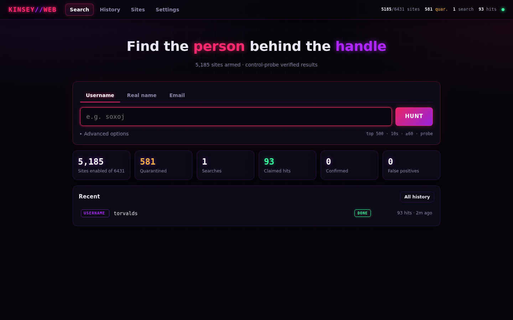
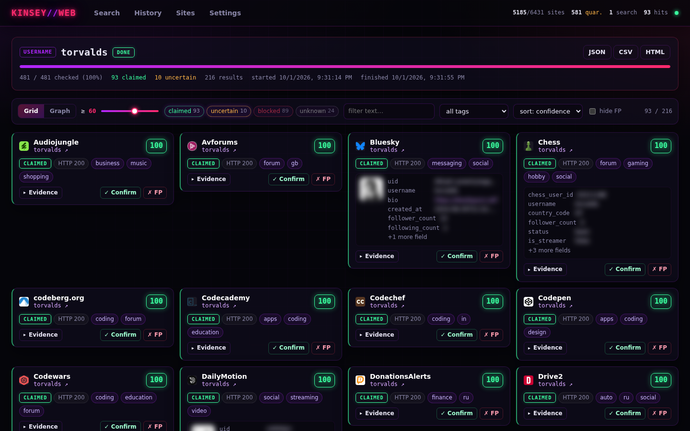
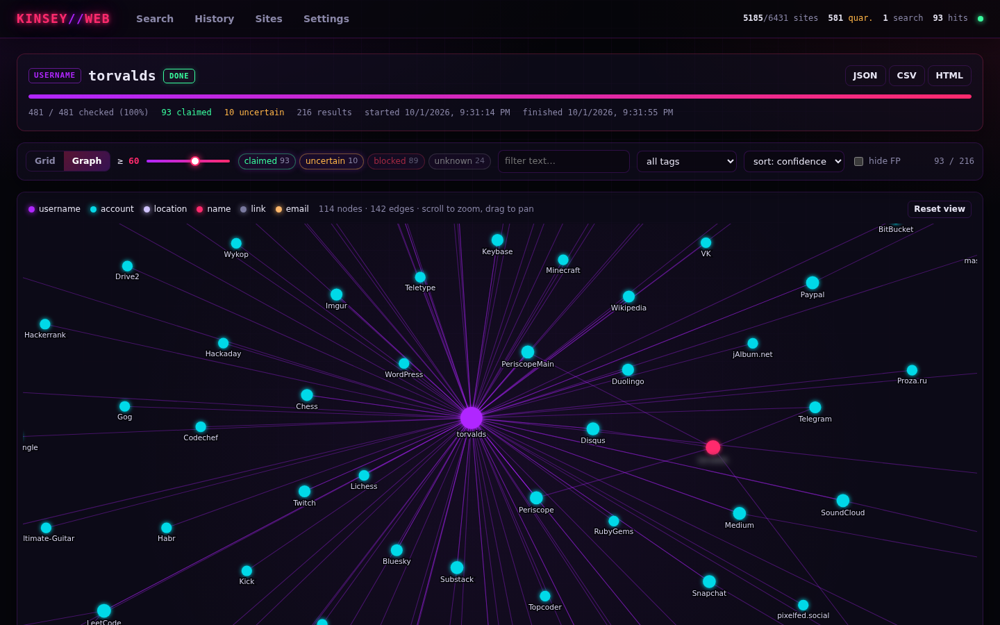
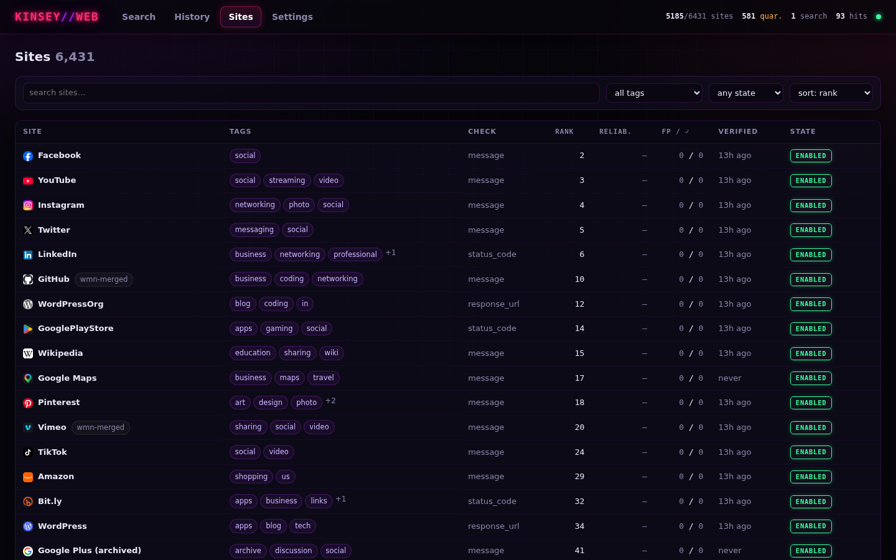
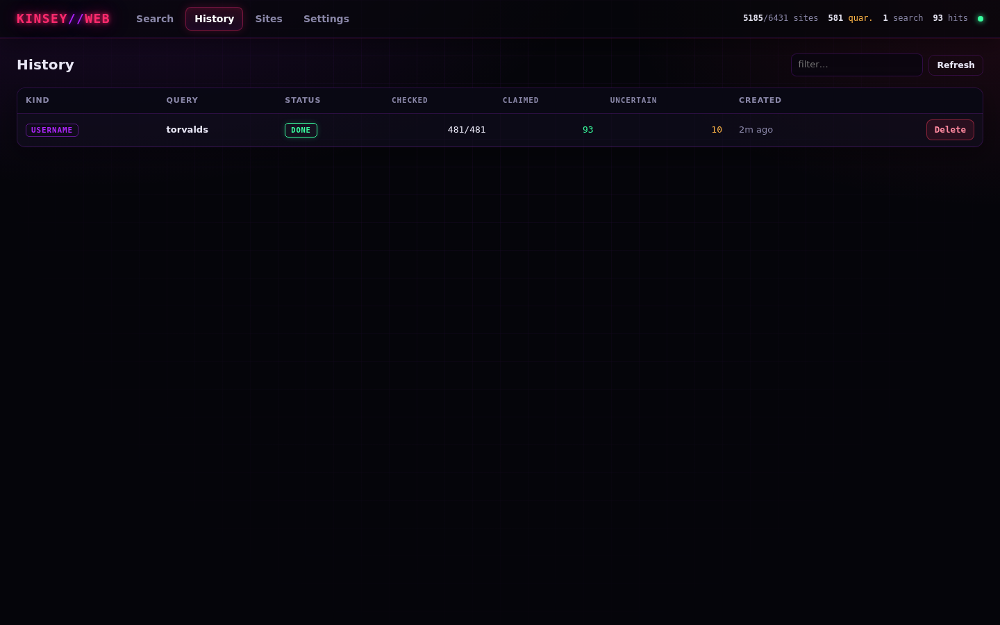
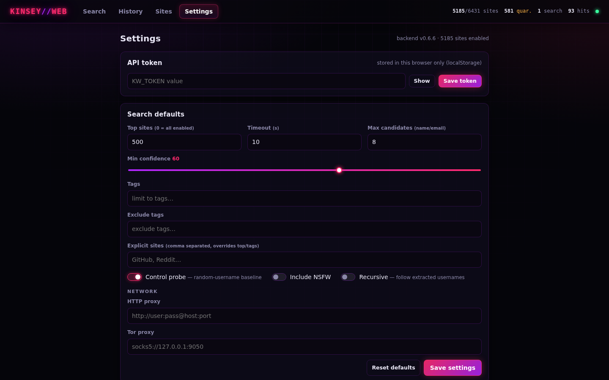

# KINSEY//WEB

kinsey-web: web-first fork of [soxoj/maigret](https://github.com/soxoj/maigret). Search for a person by
**username**, **real name**, or **email** across ~6k sites, with false-positive scoring on every hit.

No CLI. FastAPI backend (`maigret/server`; the Python package keeps upstream's `maigret` name so
upstream merges stay clean) + React/Vite/TS frontend (`web/`).



| Results | Graph |
|---|---|
|  |  |

| Sites | History | Settings |
|---|---|---|
|  |  |  |

<sub>Demo search for the public handle `torvalds`; scraped profile fields are blurred.</sub>

## What differs from upstream

- **Control probe + confidence score.** Every hit is re-checked against a random never-existing username
  on the same site. If both responses look alike (status, title, simhash of visible text, length), the hit
  is demoted. Each result carries `confidence` 0-100, scoring `reasons`, and target/control evidence.
- **Soft-404 / wall detection**: not-found phrases (multi-language), login walls, parked domains,
  redirects to homepage/login.
- **Feedback loop**: mark results confirmed / false positive; per-site reliability feeds future scores.
- **Person search**: name permutations + nickname table, and directory lookups (GitHub, GitLab, Bluesky,
  Mastodon, Keybase, Hacker News, Gravatar for email) ranked against optional context (location,
  employer, school, keywords). Top candidates are then scanned.
- **Site DB**: WhatsMyName import, quarantine flags from `tools/verify_sites.py`, NSFW excluded by default.
- Entity graph, history (SQLite), JSON/CSV/HTML export, optional bearer-token auth.

## Run

```bash
python3 -m venv .venv && .venv/bin/pip install -e . pytest pytest-asyncio pytest-httpserver httpx
cd web && npm ci && npm run build && cd ..
KW_HOST=127.0.0.1 KW_PORT=7580 .venv/bin/kinsey-web       # serves UI + /api
```

### Docker

Multi-arch image (amd64/arm64) built by CI on every push to `main`:

```bash
docker run -d --name kinsey-web -p 7580:7580 -v kinsey-data:/data \
  -e KW_TOKEN=change-me ghcr.io/mastervash/kinsey-web:latest
```

Tags: `latest`, `sha-<commit>`, and `X.Y.Z` / `X.Y` for `v*` git tags. `/data` holds the SQLite history
and the editable site DB (seeded on first start). Runs as uid 1000.

Dev: `make dev-api` and `make dev-web` (vite proxies `/api` to :7580).

Env: `KW_HOST`, `KW_PORT`, `KW_DATA_DIR` (sqlite), `KW_SITES_DB`, `KW_DIST`, `KW_TOKEN` (enables auth).
Legacy `MW_*` names still work as fallbacks.

Deploy on oci: `deploy/kinsey-web.service` (systemd --user unit, tailnet-only bind). API contract: `docs/API.md`.
Plan: `ROADMAP.md`.

## Upstream sync

GitHub fork of soxoj/maigret (Sync fork button works). Locally:

```bash
git fetch upstream && git merge upstream/main
```

Removed upstream files (CLI, Flask UI, reports) show up as modify/delete conflicts: resolve with `git rm`.
Engine files (`checking.py`, `sites.py`) are modified; expect conflicts there.
